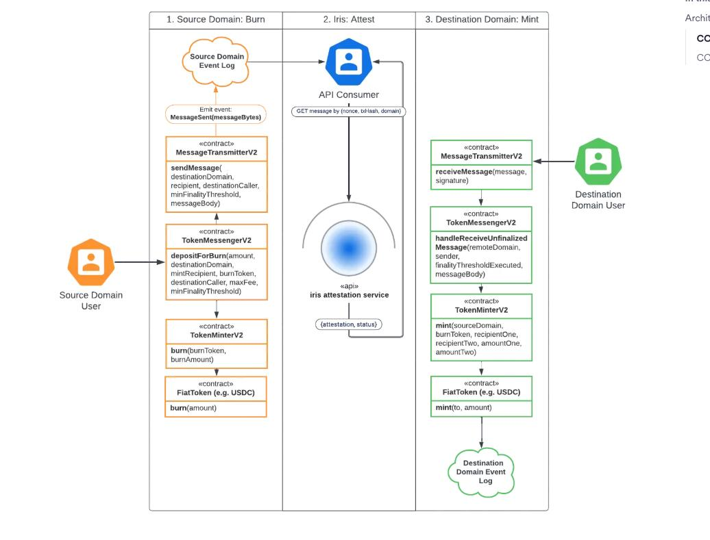
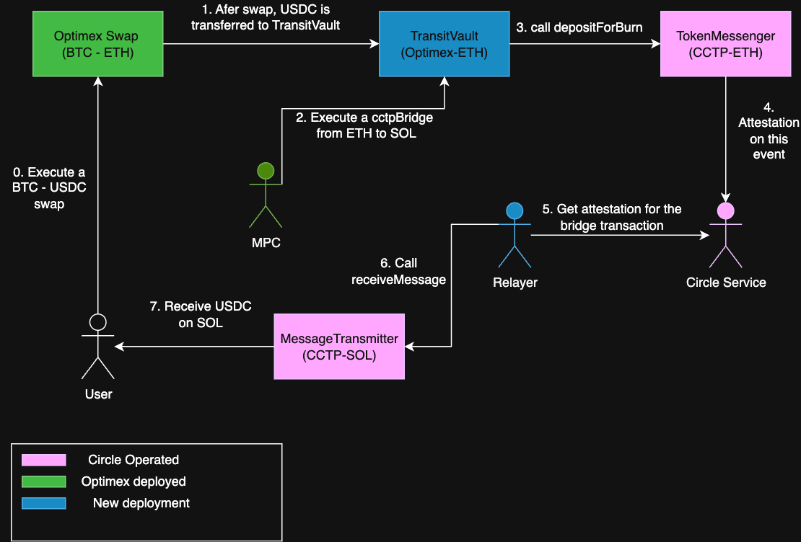
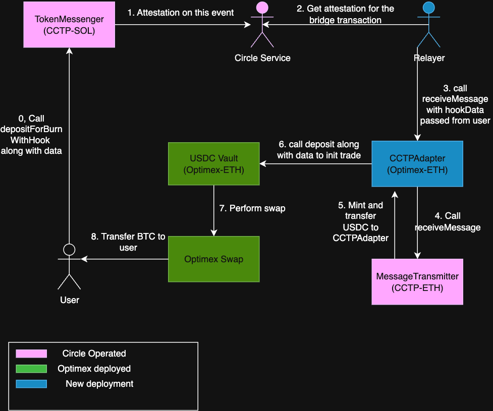

# Overview
This document outlines the integration between Optimex and Circle's Cross-Chain Transfer Protocol (CCTP) for facilitating cross-chain USDC transfers. It details how CCTP V2's mint-burn mechanism and hook functionality enable seamless token bridging, with a specific focus on transfers between Bitcoin and Solana networks.

The document covers:
- CCTP protocol overview and fee structure
- CCTP V2 workflow and components
- Optimex's integration patterns for BTC-SOL and SOL-BTC transfers

## CCTP

### Overview 

The [CCTP Protocol](https://developers.circle.com/cctp) offers a mint-burn mechanism for USDC, enabling users to bridge their USDC tokens across multiple blockchain networks.

CCTP V2 introduces fast settlement times and hook functionality, enabling quick and composable transactions across multiple blockchains.

For transfers between Ethereum and Solana, the protocol charges a fee of 1 basis point (0.01%) as documented in the [CCTP API](https://developers.circle.com/api-reference/cctp/all/get-burn-usdc-fees). This fee is separate from any gas fees required on the source and destination chains.

### How CCTP V2 Works

CCTP V2 works in 3 steps:
1. User initiates a burn transaction on the source chain.
2. Circle's attestation service validates the burn transaction and generates a cryptographically signed attestation.
3. Once the attestation is generated, it is submitted to the destination chain where the equivalent USDC tokens are minted to the recipient's address.

**Note**: CCTP does not provide a relayer service for steps 3. Using third-party relayer services (such as Wormhole) may incur additional fees.

## Optimex integrate with CCTP

### BTC - SOL

### SOL - BTC

## Relayer
### What is Relayer
A relayer is an infrastructure component that facilitates CCTP messages between the origin and destination chain.

In CCTP's architecture, there is no built-in relayer service. This means projects integrating with CCTP must either maintain their own relayer infrastructure or leverage existing third-party relayer services to handle cross-chain message delivery.

### What the Relayer does
The relayer performs two key steps in each bridge transaction:

#### Fetch Attestation
1. Once the depositForBurn transaction completes successfully on the origin chain, the relayer initiates the attestation fetch process
2. The relayer calls CCTP's API with:
   - Domain ID - A unique identifier assigned to each blockchain network in CCTP (see [supported domains](https://developers.circle.com/cctp/supported-domains))
   - Transaction Hash - The hash of the completed depositForBurn transaction
3. The relayer waits for CCTP's API response containing the attestation object:
   - For standard transfers: ~15 minutes average wait time
   - For fast transfers: ~15 seconds average wait time
   (See [CCTP V1 vs V2 differences](https://developers.circle.com/cctp#differences-between-cctp-v1-and-cctp-v2))

#### Submit Attestation 
1. Once the attestation object is received, the relayer calls the `receiveMessage` method on the destination chain's `MESSAGE_TRANSMITTER` contract to complete the cross-chain transfer. This transaction includes both the original message and the attestation signature from Circle.
2. This enables the recipient to receive their USDC tokens on the destination network